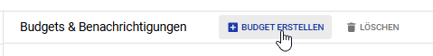

Hier ist die überarbeitete `README.md`, wobei `Dockerfile` und `cloudbuild.yaml` mit eigenen Überschriften versehen wurden:

---

## 1. GitHub-Projekt mit Google Cloud Build verbinden

### Google Cloud Console öffnen
Navigiere zur Google Cloud Console und wähle den Bereich **Cloud Build** aus.


### GitHub-Repository verknüpfen
1. Klicke auf **Trigger** und anschliessend auf **Trigger hinzufügen**.
2. Wähle **GitHub** als Repository-Quelle und folge den Anweisungen zur Verknüpfung deines GitHub-Kontos mit der Google Cloud.
3. Wähle in der Liste dein Repository **rankingladder** aus.


---

## 2. Trigger für Pipeline bei jedem Push erstellen

1. Gehe zu **Cloud Build → Trigger**.
2. Klicke auf **Trigger hinzufügen** und fülle die Felder wie folgt aus:
   - **Name:** `rankingladder-trigger`
   - **Ereignis:** "Push auf Branch"
   - **Branch:** `.*` (alle Branches)
   - **Konfigurationsdatei:** Wähle `cloudbuild.yaml`.


3. Klicke auf **Speichern**, um den Trigger zu aktivieren.

---

## 3. Cloud-Projekt und Budget einrichten

### Neues Projekt erstellen

- Öffne die [Projektübersicht](https://console.cloud.google.com/project) und erstelle ein neues Projekt mit dem Namen `rankingladder`.


### Budget erstellen

- Navigiere zu **Abrechnung → Budgets und Benachrichtigungen**.
- Erstelle ein Budget:
  - **Name:** `rankingladder-budget`
  - **Betrag:** 5 CHF
  - **Benachrichtigung:** Aktiviere die Benachrichtigung bei 100%.




---

## 4. `cloudbuild.yaml` erweitern und anpassen

### Inhalt von `cloudbuild.yaml`
```yaml
# Schritte für den Cloud Build-Prozess
steps:
  - id: "Install Dependencies"
    name: python:3.12-slim
    entrypoint: bash
    args:
      - "-c"
      - |
        pip install poetry && poetry install

  - id: "Run Tests"
    name: python:3.12-slim
    entrypoint: bash
    args:
      - "-c"
      - "pip install poetry && poetry install && poetry run pytest"

  - id: "Build Docker Image"
    name: gcr.io/cloud-builders/docker
    args:
      - "build"
      - "-t"
      - "gcr.io/$PROJECT_ID/$REPO_NAME:$COMMIT_SHA"
      - "."

  - id: "Push Docker Image"
    name: gcr.io/cloud-builders/docker
    args:
      - "push"
      - "gcr.io/$PROJECT_ID/$REPO_NAME:$COMMIT_SHA"

  - id: "Deploy to Cloud Run"
    name: gcr.io/cloud-builders/gcloud
    args:
      - "run"
      - "deploy"
      - "$REPO_NAME"
      - "--image"
      - "gcr.io/$PROJECT_ID/$REPO_NAME:$COMMIT_SHA"
      - "--region"
      - "europe-west1"
      - "--platform"
      - "managed"
      - "--allow-unauthenticated"
      - "--port"
      - "8000"
      - "--min-instances"
      - "0"
      - "--max-instances"
      - "1"

options:
  logging: CLOUD_LOGGING_ONLY
```

---

## 5. `Dockerfile` erweitern und anpassen

### Inhalt von `Dockerfile`
```dockerfile
# Erster Schritt: Basis-Image für den Builder festlegen
FROM python:3.12-slim AS builder
WORKDIR /tmp

# Poetry installieren, um Abhängigkeiten zu verwalten
RUN pip install poetry

# Projektdateien in das Arbeitsverzeichnis kopieren
COPY ./pyproject.toml ./poetry.lock ./

# Abhängigkeiten exportieren
RUN poetry export -f requirements.txt --output requirements.txt --without-hashes --without dev

# Zweiter Schritt: Endgültiges Image erstellen
FROM python:3.12-slim
WORKDIR /app

# Kopiere die exportierten Abhängigkeiten
COPY --from=builder /tmp/requirements.txt .

# Installiere die Abhängigkeiten
RUN pip install -r requirements.txt

# Entferne nicht mehr benötigte Dateien, um Platz zu sparen
RUN rm requirements.txt

# Anwendungscode in das Image kopieren
COPY ./src /app

# Definiere den Startbefehl für die Anwendung
CMD ["uvicorn", "main:app", "--host", "0.0.0.0", "--port", "8000"]

# Port für den Zugriff öffnen
EXPOSE 8000
```

---

## 6. Cloud Run Deployment überprüfen

1. Gehe zu **Cloud Run** und überprüfe, ob der Service `rankingladder` erfolgreich aufgelistet ist.
2. Kopiere die URL des Services und öffne sie in deinem Browser, um die Anwendung zu testen.


---

## 7. Berechtigungen anpassen

1. Öffne die **IAM**-Verwaltung in der Google Cloud Console.
2. Bearbeite das Dienstkonto und füge die Rolle **Cloud Functions Admin** hinzu.


---

## 8. Projekt pushen und Pipeline testen

1. Pushe dein Projekt inklusive angepasster `Dockerfile` und `cloudbuild.yaml` zu GitHub. Die Cloud Build Pipeline wird automatisch ausgelöst.
2. Überprüfe in der Google Cloud Console, ob die Tests und der Build erfolgreich sind.


---

## 9. Logs und Fehleranalyse

- Falls ein Test fehlschlägt, wird dies in den Logs angezeigt.
- Öffne den Bereich **Logs** in der Google Cloud Console, um Details einzusehen.


---

## 10. Service-URL kopieren und Anwendung testen

1. Öffne den Bereich **Cloud Run** in der Google Cloud Console.
2. Wähle den Service `rankingladder` aus der Liste aus.
3. Kopiere die URL des bereitgestellten Services.


4. Öffne die kopierte URL in einem Webbrowser.
5. Stelle sicher, dass die Anwendung korrekt geladen wird. Im gezeigten Beispiel wird eine JSON-Nachricht mit dem Text `{ "message": "Hello World" }` angezeigt.


---


## 11. Nützliche Links

Hier sind einige hilfreiche Links, um deine Dokumentation und Entwicklung zu unterstützen:

- **Google Cloud Console**: [https://console.cloud.google.com](https://console.cloud.google.com)  
  Zugriff auf alle Google Cloud-Dienste, einschließlich Cloud Build und Cloud Run.

- **Cloud Build Dokumentation**: [https://cloud.google.com/build/docs](https://cloud.google.com/build/docs)  
  Offizielle Dokumentation zu Cloud Build, um Pipelines zu konfigurieren und zu verwalten.

- **Cloud Run Dokumentation**: [https://cloud.google.com/run/docs](https://cloud.google.com/run/docs)  
  Informationen zur Bereitstellung und Verwaltung von Anwendungen auf Cloud Run.

- **Poetry Dokumentation**: [https://python-poetry.org/docs/](https://python-poetry.org/docs/)  
  Anleitung zur Verwendung von Poetry für Python-Projekte.

- **Docker Dokumentation**: [https://docs.docker.com](https://docs.docker.com)  
  Hilfreiche Ressourcen zur Erstellung, Verwaltung und Bereitstellung von Docker-Containern.

- **Markdown Syntax Guide**: [https://www.markdownguide.org/basic-syntax/](https://www.markdownguide.org/basic-syntax/)  
  Grundlagen zur Erstellung von Dokumentationen im Markdown-Format.

- **GitHub Hilfe**: [https://docs.github.com/](https://docs.github.com/)  
  Unterstützung zur Nutzung von GitHub für Versionskontrolle und Zusammenarbeit.

---
