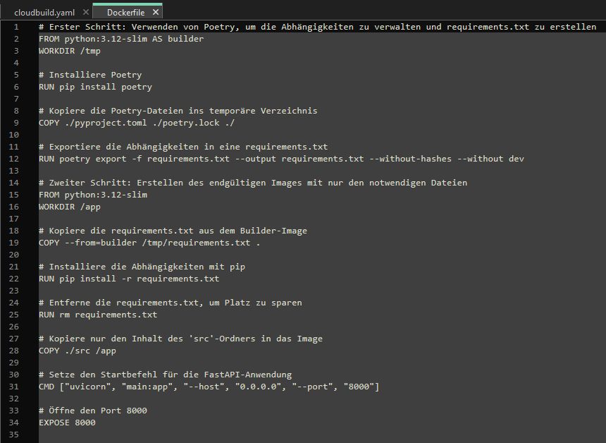
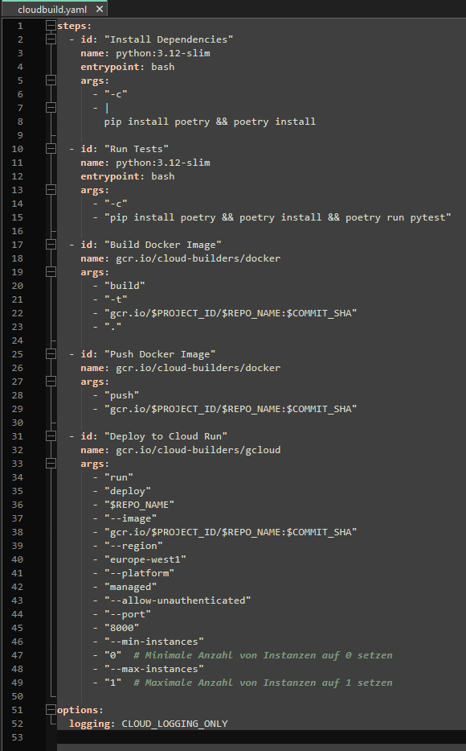
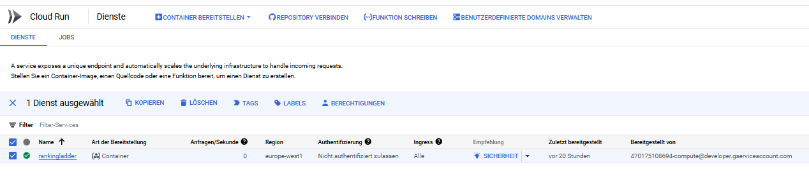

## 1. GitHub-Projekt mit Google Cloud Build verbinden

### Google Cloud Console öffnen
Navigiere zur Google Cloud Console und wähle den Bereich **Cloud Build** aus.

### GitHub-Repository verknüpfen
1. Klicke auf **Trigger** und anschliessend auf **Trigger hinzufügen**.
2. Wähle **GitHub** als Repository-Quelle und folge den Anweisungen zur Verknüpfung deines GitHub-Kontos mit der Google Cloud.
3. Wähle in der Liste dein Repository **rankingladder** aus.

## 2. Trigger für Pipeline bei jedem Push erstellen

1. Gehe zu **Cloud Build → Trigger**.
2. Klicke auf **Trigger hinzufügen** und fülle die Felder wie folgt aus:
   - **Name:** `rankingladder-trigger`
   - **Ereignis:** "Push auf Branch"
   - **Branch:** `.*` (alle Branches)
   - **Konfigurationsdatei:** Wähle `cloudbuild.yaml`.

3. Klicke auf **Speichern**, um den Trigger zu aktivieren.

## 3. Cloud-Projekt und Budget einrichten

### Neues Projekt erstellen

- Öffne die [Projektübersicht](https://console.cloud.google.com/project) und erstelle ein neues Projekt mit dem Namen `rankingladder`.

### Budget erstellen

- Navigiere zu **Abrechnung → Budgets und Benachrichtigungen**.
- Erstelle ein Budget:
  - **Name:** `rankingladder-budget`
  - **Betrag:** 5 CHF
  - **Benachrichtigung:** Aktiviere die Benachrichtigung bei 100%.

## 4. `cloudbuild.yaml` erweitern und anpassen

Überprüfe, ob deine `cloudbuild.yaml` folgende Schritte enthält:
- **Docker-Image erstellen:** Der Abschnitt `Build Docker Image` stellt sicher, dass ein Image gebaut wird.
- **Deployment:** Der Abschnitt `Deploy to Cloud Run` sorgt dafür, dass das Image als Service bereitgestellt wird.

## 5. Cloud Run Deployment überprüfen

1. Gehe zu **Cloud Run** und überprüfe, ob der Service `rankingladder` erfolgreich aufgelistet ist.
2. Kopiere die URL des Services und öffne sie in deinem Browser, um die Anwendung zu testen.

## 6. Berechtigungen anpassen

1. Öffne die **IAM**-Verwaltung in der Google Cloud Console.
2. Bearbeite das Dienstkonto und füge die Rolle **Cloud Functions Admin** hinzu.

## 7. Projekt pushen und Pipeline testen

1. Pushe dein Projekt inklusive angepasster `Dockerfile` und `cloudbuild.yaml` zu GitHub. Die Cloud Build Pipeline wird automatisch ausgelöst.
2. Überprüfe in der Google Cloud Console, ob die Tests und der Build erfolgreich sind.

## 8. Logs und Fehleranalyse

- Falls ein Test fehlschlägt, wird dies in den Logs angezeigt.
- Öffne den Bereich **Logs** in der Google Cloud Console, um Details einzusehen.

## 9. Service-URL kopieren und Anwendung testen

1. Öffne den Bereich **Cloud Run** in der Google Cloud Console.
2. Wähle den Service `rankingladder` aus der Liste aus.
3. Kopiere die URL des bereitgestellten Services.

4. Öffne die kopierte URL in einem Webbrowser.
5. Stelle sicher, dass die Anwendung korrekt geladen wird. Im gezeigten Beispiel wird eine JSON-Nachricht mit dem Text `{ "message": "Hello World" }` angezeigt.

